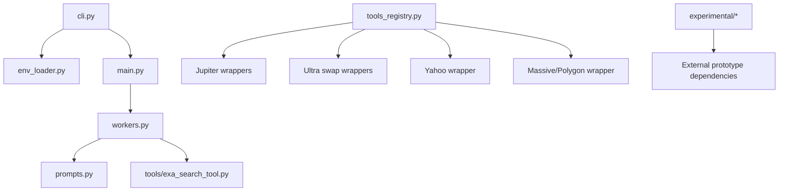
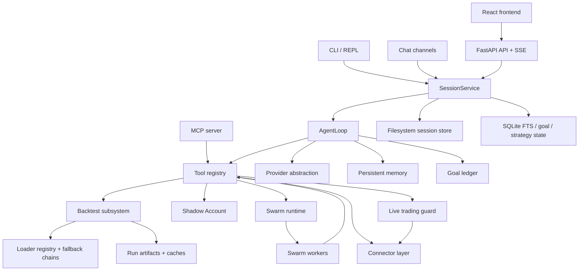
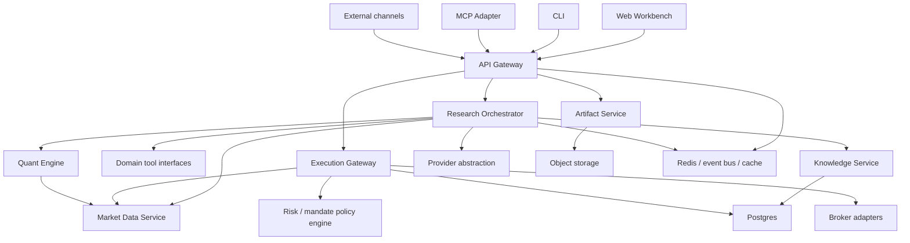

# Technical Design Document

## AutoHedge vs Vibe-Trading

Date: 2026-07-23  
Scope: Architecture analysis of the attached `AutoHedge` and `Vibe-Trading` repository snapshots.  
Constraint: No code was written; this document is based on repository inspection only.

## 1. Executive Summary

The two repositories are not peers in maturity.

`AutoHedge` is a compact concept prototype centered on a prompt-driven multi-agent chain. It is easy to understand, but it is not close to production readiness. It has no durable state model, no real service boundaries, no test suite, no live safety controls, and no true integration between its orchestration layer and most of its market/execution utilities.

`Vibe-Trading` is already a platform. It combines:

- a backend API
- a CLI
- an MCP server
- a React frontend
- multi-agent swarm orchestration
- a broad tool registry
- multiple market-data loaders
- a sizeable backtesting subsystem
- a live-trading safety layer
- a Shadow Account workflow
- persistent session, goal, and strategy storage
- a very large automated test surface

The correct strategic decision is:

Use `Vibe-Trading` as the architectural base for any brand-new production system.  
Do not merge `AutoHedge` directly into production.  
Retain only its product ideas:

- simple role-based agent decomposition
- hedge-fund style committee framing
- Solana/Jupiter intent as a future adapter domain

## 2. Analysis Method

The analysis was based on extracted snapshots of:

- `AutoHedge-main.zip`
- `Vibe-Trading-main.zip`

Key observations were derived from:

- folder structure
- entrypoints
- packaging metadata
- import relationships
- tool and connector inventories
- persistence layers
- workflow modules
- frontend/backend boundaries
- test inventory

## 3. Repository Profile Comparison

| Dimension | AutoHedge | Vibe-Trading |
|---|---|---|
| Approximate tracked file count | 25 | 1847 |
| Core runtime style | Single Python package + REPL | Full platform: API + CLI + MCP + frontend + channels |
| Main entrypoints | `autohedge.cli`, `autohedge.main` | `agent/api_server.py`, `agent/mcp_server.py`, `agent/cli/main.py`, `frontend/` |
| Agent model | One director handing off to specialist agents | Session agent loop + swarm worker runtime + 30 swarm presets |
| Persistence | Minimal local files only | Filesystem, SQLite FTS, goal ledger, strategy store, memory store, run artifacts |
| Web/API surface | None | FastAPI REST + SSE + auth surfaces |
| Frontend | None | React 19 + Vite SPA |
| Backtesting | None in mainline, only experimental script | Mature subsystem with engines, loaders, validators, optimizers |
| Live trading safety | None | Mandates, kill switch, order guard, audit trail, connector profiles |
| Tests | No repo test suite found | 369 backend tests, 35 frontend tests |
| Production readiness | Low | Medium, but monolithic and internally fragmented |

## 4. Complete Architecture Analysis: AutoHedge

### 4.1 Folder Structure

| Path | Purpose |
|---|---|
| `autohedge/` | Main package |
| `autohedge/cli.py` | Interactive CLI / REPL |
| `autohedge/main.py` | Top-level `AutoHedge` orchestration object |
| `autohedge/workers.py` | Agent definitions and handoff topology |
| `autohedge/prompts.py` | Prompt library for director, quant, sentiment, risk, execution |
| `autohedge/env_loader.py` | `.env` discovery and loading |
| `autohedge/tools/` | External API wrappers |
| `experimental/` | Prototypes outside the main architecture |
| `logs/` | Committed runtime output samples |

### 4.2 Architectural Shape

`AutoHedge` is essentially a prompt orchestration shell around the `swarms` framework.

High-level runtime:

1. CLI loads environment.
2. User enters a free-form task.
3. `AutoHedge.run()` records the prompt into a lightweight conversation object.
4. The `director_agent` executes.
5. The director may hand off to quant, sentiment, risk, and execution agents through the `swarms` runtime.
6. Output is returned as conversation text.

Important architectural reality:

- The architecture is agent-first, not domain-model-first.
- Prompts are the main control surface.
- The orchestration layer has almost no typed business logic.
- Most domain behavior lives outside the main flow as disconnected utility wrappers.

### 4.3 Dependency Graph



Practical dependency conclusion:

- `workers.py` is the real center of the system.
- `tools_registry.py` is not part of the main orchestration path.
- Execution-related utilities exist, but they are not strongly connected to the live agent loop.

### 4.4 Agents

Defined agents:

- `Trading-Director`
- `Quant-Analyst`
- `Risk-Manager`
- `Execution-Agent`
- `Sentiment-Agent`

Strength of this design:

- responsibilities are conceptually clear

Weakness of this design:

- responsibilities are described in prompts, not enforced through typed contracts
- no durable handoff schema exists
- no audit ledger exists for agent decisions
- no broker safety gate sits between agent intent and execution utilities

### 4.5 APIs and Integrations

Integrated wrappers:

- Exa search API
- Jupiter token search
- Jupiter token pricing
- Jupiter Ultra order generation and execution
- Yahoo Finance via `yfinance`
- Massive API wrapper stored under `polygon_api.py`

Observations:

- The repository markets Solana support, and those Jupiter utilities are the closest thing to real execution infrastructure.
- The execution agent itself is not directly wired to those Jupiter tools in the main runtime path.
- README/env contract drift exists:
  - README mentions `WALLET_PRIVATE_KEY`
  - code expects `SOLANA_PRIVATE_KEY`
  - Exa and Massive keys are also required by some tools but not part of a coherent config story

### 4.6 Database and Persistence

There is no application database.

Persisted state is limited to:

- recent task text file under the user home directory
- output/log directories
- conversation history in memory during one run

Implications:

- no session recovery
- no auditability
- no reproducibility
- no model for accounts, strategies, orders, fills, risk events, or research objects

### 4.7 Models

There are almost no real domain models.

The system relies on:

- free-form strings
- prompt instructions
- lightweight utility return JSON strings

What is missing:

- typed thesis model
- typed risk assessment model
- typed order intent model
- typed execution result model
- typed portfolio state model

### 4.8 Workflows

Main workflow:

1. User asks for analysis.
2. Director agent runs.
3. Director can hand off to specialists.
4. Result is returned as text.

Experimental workflows:

- Bitcoin transaction monitor over websocket
- crypto analysis wrapper using an external `cryptoagent`
- a standalone market-making simulator/backtest script

These experimental flows are not integrated into the main package architecture.

### 4.9 Utilities and Common Code

Useful utilities:

- upward `.env` discovery
- simple REPL UX
- clean wrapper style for external APIs

Weak utilities:

- no shared domain library
- no shared policy engine
- no shared persistence layer
- no shared validation layer

### 4.10 Bottom-Line Assessment of AutoHedge

`AutoHedge` is best understood as:

- a product concept prototype
- a prompt-first demo
- a small research sandbox

It is not a reusable production core.

## 5. Complete Architecture Analysis: Vibe-Trading

### 5.1 Folder Structure

Top-level structure:

| Path | Purpose |
|---|---|
| `agent/` | Python backend package, CLI, MCP server, backtesting, tests |
| `frontend/` | React SPA |
| `wiki/` | Public docs/static site |
| `assets/` | Media assets |
| `scripts/` | Developer helpers |
| `tools/` | CI/support scripts |

Backend structure under `agent/`:

| Path | Purpose |
|---|---|
| `backtest/` | Quant engine, loaders, validation, optimizers |
| `cli/` | Interactive and legacy CLI layers |
| `src/agent/` | Core LLM agent loop, context, progress, trace |
| `src/api/` | FastAPI route groups and HTTP security helpers |
| `src/channels/` | Telegram, Slack, Discord, Teams, Matrix, etc. |
| `src/config/` | Typed configuration system |
| `src/factors/` | Factor analysis framework + Alpha Zoo |
| `src/goal/` | Goal ledger and auditing |
| `src/live/` | Live trading safety and mandate enforcement |
| `src/memory/` | Persistent memory lifecycle |
| `src/providers/` | LLM/provider abstraction |
| `src/scheduled_research/` | Scheduled research jobs |
| `src/session/` | Session store, SSE event bus, execution lifecycle |
| `src/shadow_account/` | Journal analysis, extraction, backtest, report rendering |
| `src/skills/` | 88 finance skills |
| `src/strategy_store/` | Strategy artifact and decay tracking store |
| `src/swarm/` | Multi-agent orchestration runtime |
| `src/tools/` | Tool catalog and MCP wrappers |
| `src/trading/` | Connector abstractions and broker integrations |

Subsystem size signals from the repository:

- `src/factors`: 482 files
- `src/skills`: 404 files
- `src/tools`: 66 files
- `src/trading`: 60 files
- `src/swarm`: 39 files
- `src/channels`: 28 files
- `backtest/loaders`: 35 files
- `backtest/engines`: 13 files
- `agent/tests`: 369 test files
- `frontend` test files: 35

### 5.2 Architectural Shape

`Vibe-Trading` is a large monorepo that combines product surfaces, domain engines, orchestration runtimes, and documentation in one codebase.

Its actual architecture is layered, but only partially separated:



The codebase already contains the core ingredients of a production system, but they are packed into a single repository and tied together through a central tool hub.

### 5.3 Internal Dependency Graph

Two dependency facts matter more than anything else:

1. `src.tools` is the architectural hub.
2. `src.agent.loop` and `src.swarm.worker` are parallel orchestration implementations.

High-level import pressure from the inspected source tree:

- `src.tools` imports `agent`, `config`, `factors`, `goal`, `hypotheses`, `live`, `market_data`, `memory`, `providers`, `security`, `session`, `shadow_account`, `strategy_store`, `swarm`, and `trading`
- `src.api` depends on `channels`, `config`, `factors`, `goal`, `live`, `providers`, `scheduled_research`, `session`, `swarm`, `tools`, and `trading`
- `src.swarm` depends on `agent`, `config`, `providers`, and `tools`
- `src.live` depends on `config`, `tools`, and heavily on `trading`
- `backtest` is internally coherent: runner -> engines/loaders/models/validation

This means:

- `tools` acts as a god-package
- `api` is a broad assembler rather than a thin façade
- domain boundaries exist conceptually, but central orchestration crosses many of them directly

### 5.4 Agents

There are two real agent runtimes.

#### A. Session Agent Runtime

The session runtime is centered on `src/agent/loop.py`.

Characteristics:

- ReAct-style loop
- tool batching for readonly tools
- context compaction layers
- token usage accounting
- event streaming
- goal continuation logic
- persistent memory integration
- provider abstraction

This is the runtime behind interactive research sessions.

#### B. Swarm Runtime

The swarm runtime is centered on `src/swarm/runtime.py` and `src/swarm/worker.py`.

Characteristics:

- DAG execution
- layer-by-layer parallel scheduling
- 30 preset agent teams
- per-worker tool whitelists
- background execution with events and persistence

This is not a thin wrapper around `AgentLoop`; it is a second orchestration system.

#### Agent Observation

The repository is strong in agent product breadth, but weaker in runtime unification.

### 5.5 APIs and Product Surfaces

`Vibe-Trading` exposes the same domain through multiple surfaces:

#### FastAPI

Route groups include:

- runs
- sessions
- system
- settings
- uploads
- channels
- swarm
- live trading
- alpha zoo
- auth
- scheduled research
- qveris integration

#### MCP Server

The MCP server is a first-class surface, not a sidecar. It exposes finance research tools to external MCP clients while explicitly excluding unsafe direct order placement.

#### CLI

The CLI includes:

- interactive chat
- command routing
- onboarding
- model/settings flows
- live runtime commands
- legacy subcommand compatibility

#### Frontend

The frontend is a real workbench:

- agent chat
- SSE streaming
- tool progress
- reports
- runtime/live status
- alpha zoo
- correlation/regime panels
- settings

#### Channels

The backend can push the same session model through multiple messaging surfaces:

- Slack
- Discord
- Telegram
- Teams
- Matrix
- Signal
- WhatsApp
- QQ/NapCat
- WeChat/WeCom
- Feishu/Lark
- DingTalk
- email
- Mochat
- websocket

### 5.6 Database and Persistence

Persistence is broad but fragmented.

#### Filesystem Stores

- session JSON and JSONL logs
- run directories and artifacts
- uploads
- swarm run artifacts
- shadow reports
- memory markdown files

#### SQLite Stores

- `sessions.db` for session full-text search
- goal ledger tables inside the same database
- strategy store in a separate SQLite-backed module

#### DuckDB / Parquet

- local data bridge support
- loader caching pathways
- read-only local market-data access

#### Architectural Assessment

This is functional and pragmatic, but not a clean production storage architecture.

The current design has:

- dual-write behavior between filesystem and SQLite
- multiple state models for similar concepts
- uneven durability guarantees
- local-machine assumptions in several workflows

### 5.7 Models

Unlike `AutoHedge`, `Vibe-Trading` has real domain modeling.

Model families include:

- Pydantic API models
- config schemas
- backtest position/trade/equity models
- swarm run/task/worker models
- goal/claim/evidence/audit models
- live mandate and breach models
- shadow account profile/rule/result models

This is one of the strongest parts of the repository.

### 5.8 Workflows

#### A. Interactive Research Workflow

1. User creates or reuses a session.
2. Session service persists the message.
3. Session service launches the `AgentLoop`.
4. `AgentLoop` builds a tool registry and provider runtime.
5. SSE emits progress, tool calls, and completion events.
6. Results and artifacts are persisted to the session/run stores.

#### B. Swarm Workflow

1. User selects a preset.
2. Swarm runtime builds a DAG from preset YAML.
3. Tasks are topologically layered.
4. Workers execute in parallel per layer.
5. Results, summaries, and events are persisted.

#### C. Backtest Workflow

1. Config is validated.
2. Source loader is resolved through market-aware fallback chains.
3. Signal engine is loaded and AST-scrubbed.
4. Engine executes bar-by-bar.
5. Metrics, validation, run cards, and artifacts are emitted.

#### D. Shadow Account Workflow

1. Parse broker journal.
2. Pair round-trips.
3. Extract profitable rules.
4. Backtest the shadow strategy.
5. Render HTML/PDF report.

#### E. Live Trading Workflow

1. Connector profile is selected and checked.
2. Mandate must exist and be valid.
3. Order tool is wrapped by live guard.
4. Halt flag is checked.
5. Intent is normalized and priced.
6. Risk and daily count are enforced.
7. Decision is audit logged.

#### F. Scheduled Research Workflow

1. Job is persisted.
2. Executor wakes on schedule.
3. Due jobs are dispatched.
4. Status and next-run timestamps are updated.

### 5.9 Utilities and Common Code

The repository has a large amount of reusable utility infrastructure:

- typed config loading and validation
- path safety and redaction
- prompt-injection scanning for untrusted content
- token/accounting helpers
- loader retry and cache helpers
- run-card/report shaping
- host/origin guards and SSE tickets
- channel discovery and plugin loading

This utility layer is a major reusable asset.

### 5.10 Duplicate Functionality Inside Vibe-Trading

The main internal duplication areas are:

| Area | Duplicate Surfaces | Why It Matters |
|---|---|---|
| Agent orchestration | `src/agent/loop.py` and `src/swarm/worker.py` | Two ReAct runtimes increase maintenance cost and behavior drift |
| Session persistence | filesystem store plus SQLite FTS mirror | Dual-write and reindex complexity |
| Product exposure | CLI, API, MCP, channels all expose overlapping tool-backed capabilities | Hard to maintain consistent contracts and auth rules |
| Skill vs tool knowledge | Many skills mirror tool capabilities as prose wrappers | Useful for UX, but creates documentation and capability drift risk |
| Live broker classification | curated maps repeated per connector | Safe, but operationally repetitive |
| State storage | files, SQLite, memory markdown, run dirs, strategy store | No single canonical data model |

### 5.11 Bottom-Line Assessment of Vibe-Trading

`Vibe-Trading` is a strong base for a production system because it already contains:

- product surfaces
- domain depth
- safety controls
- test coverage
- multiple user workflows

Its main problem is not missing capability.  
Its main problem is structural overgrowth.

## 6. Common Code and Cross-Repository Duplicate Functionality

### 6.1 Functional Overlap Between Repositories

| Capability | AutoHedge | Vibe-Trading | Assessment |
|---|---|---|---|
| Multi-agent research | Yes, prompt-only handoff model | Yes, session + swarm runtimes | Vibe is more complete |
| Market data retrieval | Simple wrappers | Full loader registry and fallback chains | Vibe wins decisively |
| Sentiment / web research | Exa search + prompt | Web search, web reader, research tools, skills | Vibe is broader |
| Risk logic | Prompted risk agent | Explicit live order guard and mandate checks | Vibe is production-oriented |
| Trade execution | Utility wrappers exist | Connector model plus live safety | Vibe is much stronger |
| Backtesting | Only experimental standalone script | Dedicated subsystem | Vibe already solves this |
| Persistence | Minimal | Multiple persistent stores | Vibe stronger but needs consolidation |
| UI / product surfaces | REPL only | CLI + API + MCP + web + channels | Vibe much stronger |

### 6.2 What AutoHedge Adds That Vibe Does Not Already Have

Very little code should be transplanted directly.

What it adds conceptually:

- cleaner hedge-fund role framing
- simpler product story
- explicit sentiment/quant/risk/execution mental model
- Solana/Jupiter-oriented execution intent

## 7. Strengths of AutoHedge

- Very small cognitive footprint.
- The role decomposition is intuitive and easy to explain to non-engineers.
- The prompt library makes the intended hedge-fund workflow obvious.
- Jupiter-related wrappers show a possible crypto-native execution direction.
- It is easy to prototype new agent prompts quickly because the system is thin.

## 8. Strengths of Vibe-Trading

- Wide product surface with real user-facing workflows.
- Strong backtesting and market-data architecture relative to the rest of the market.
- A serious safety posture for live trading:
  - mandate gating
  - kill switch
  - order intent extraction
  - audit logging
  - read/write classification
- Large automated test surface.
- Rich domain assets:
  - Alpha Zoo
  - Shadow Account
  - factor analysis
  - scheduled research
  - swarm presets
  - multiple channel integrations
- Better typed models and stronger validation than a typical LLM-first repo.

## 9. Weaknesses of Each Repository

### 9.1 Weaknesses of AutoHedge

- No production-grade persistence.
- No API, web UI, scheduling layer, or service boundaries.
- No test suite found in the repository.
- Most outputs are free-form strings instead of typed contracts.
- Tooling is not coherently integrated into the main orchestration flow.
- Execution safety is effectively absent.
- Experimental modules are disconnected from the main system.
- Configuration contract drift already exists.
- The repo is too small to support institutional operations.

### 9.2 Weaknesses of Vibe-Trading

- Too many bounded contexts are packed into one monorepo.
- `src.tools` is over-centralized and imports too much of the system.
- Two agent runtimes exist instead of one.
- Persistence is fragmented across filesystem, SQLite, and ad hoc local state.
- API assembly is broad and somewhat procedural rather than service-oriented.
- Local-machine assumptions remain in several workflows.
- Product breadth increases maintenance and security burden.
- Documentation/site content lives beside runtime code rather than in a clearly separate product boundary.

## 10. Which Modules Should Be Reused

These should be treated as foundation candidates for the new production system.

| Source | Module(s) | Action | Why |
|---|---|---|---|
| Vibe-Trading | `agent/backtest/*` | Reuse | Best existing quantitative core in either repo |
| Vibe-Trading | `agent/backtest/loaders/*` | Reuse | Strong market-data normalization and fallback design |
| Vibe-Trading | `agent/backtest/validation.py`, `metrics.py`, `run_card.py`, `risk_xray.py` | Reuse | Valuable research validation layer |
| Vibe-Trading | `agent/src/live/*` | Reuse | Strongest production-grade safety layer present |
| Vibe-Trading | `agent/src/trading/connectors/*` | Reuse selectively | Useful connector abstractions and classifications |
| Vibe-Trading | `agent/src/config/*` | Reuse | Typed config system is solid and central |
| Vibe-Trading | `agent/src/security/*` | Reuse | Good security primitives for prompt/content boundaries |
| Vibe-Trading | `agent/src/shadow_account/*` | Reuse | Distinctive and high-value workflow |
| Vibe-Trading | `agent/src/factors/*` | Reuse | Strong alpha/factor library |
| Vibe-Trading | `frontend/src/components/charts/*` and major pages | Reuse selectively | Good UI building blocks for research workbench |

## 11. Which Modules Should Be Rewritten

These are useful, but should not be carried forward unchanged.

| Source | Module(s) | Action | Why |
|---|---|---|---|
| AutoHedge | `autohedge/main.py`, `workers.py`, `prompts.py` | Rewrite | Good ideas, weak production structure |
| AutoHedge | `autohedge/tools/*` | Rewrite | API wrappers are useful references but need typed contracts, retries, auth policy, and live safety |
| Vibe-Trading | `agent/src/agent/loop.py` and `agent/src/swarm/worker.py` | Rewrite into one runtime | Duplicate orchestration behavior should converge |
| Vibe-Trading | `agent/src/tools/__init__.py` and tool registry assembly | Rewrite | Too centralized; move to explicit domain service registries |
| Vibe-Trading | `agent/src/session/*` | Rewrite | Filesystem-first session model is good for local dev, weak for production |
| Vibe-Trading | `agent/src/memory/*` | Rewrite | File-based markdown memory is convenient but not a production knowledge layer |
| Vibe-Trading | `agent/src/goal/*` | Rewrite around shared control-plane data model | Good semantics, but current storage coupling should be cleaned up |
| Vibe-Trading | `agent/api_server.py` route assembly pattern | Rewrite | Needs cleaner service composition and dependency injection |
| Vibe-Trading | `agent/src/channels/*` | Rewrite behind a stricter adapter boundary | Product value is high, but operational surface is large |
| Vibe-Trading | `agent/src/strategy_store/*` | Rewrite into canonical research artifact service | Good concept, but should share a unified persistence model |

## 12. Which Modules Should Be Deleted or Retired

These should not be carried into the new production baseline.

| Source | Module(s) | Action | Why |
|---|---|---|---|
| AutoHedge | `experimental/*` | Delete from production baseline | Prototype code, not integrated architecture |
| AutoHedge | `logs/*` | Delete from source baseline | Runtime artifacts do not belong in the core product repo |
| AutoHedge | `example.py` | Retire | Demo-only |
| AutoHedge | direct production use of the whole package | Retire | Preserve ideas only, not the implementation |
| Vibe-Trading | `wiki/` in the runtime monorepo | Split out | Docs site should not live inside core production runtime |
| Vibe-Trading | `agent/cli/_legacy.py` after migration | Retire | Legacy routing should not survive the redesigned CLI |
| Vibe-Trading | one of `AgentLoop` or `swarm/worker` | Delete after convergence | One orchestration runtime should remain |
| Vibe-Trading | filesystem-first session persistence once control-plane DB is live | Retire | Replace with canonical persistent service |
| Vibe-Trading | markdown memory index once knowledge service is live | Retire | Replace with structured memory/knowledge storage |

## 13. Proposed Architecture for a Brand-New Production System

### 13.1 Core Design Decision

The new system should be built as a production research-and-execution platform with clear bounded contexts, not as a single monolithic LLM app.

Recommended principle:

LLMs orchestrate decisions.  
They do not own persistence, market data truth, risk policy, or broker connectivity.

### 13.2 Target Bounded Contexts

| Service / Package | Responsibilities | Seed from Current Repos |
|---|---|---|
| API Gateway | Auth, session APIs, SSE/WebSocket, frontend-facing contracts | Vibe API patterns |
| Research Orchestrator | Unified agent runtime, tool execution, reasoning traces, goals | Vibe AgentLoop + swarm ideas |
| Quant Engine | Backtests, factor analysis, validation, run cards, artifacts | Vibe backtest subsystem |
| Market Data Service | Symbol normalization, provider routing, caching, historical bars, fundamentals | Vibe loaders |
| Knowledge Service | Research memory, session search, reusable artifacts, notes, retrieval | Vibe goal/session/memory ideas |
| Execution Gateway | Broker adapters, mandates, kill switch, order policies, audit trail | Vibe live + trading connectors |
| Artifact Service | Reports, PDFs, uploads, rendered outputs, run bundles | Vibe shadow/report patterns |
| Frontend Workbench | Chat, runs, reports, alpha lab, live runtime, settings | Vibe frontend |
| CLI / MCP Adapters | Thin client surfaces over the same backend contracts | Vibe CLI + MCP concepts |

### 13.3 Target Logical Architecture



### 13.4 Storage Architecture

Recommended production storage model:

| Storage | Use |
|---|---|
| Postgres | sessions, goals, evidence, mandates, broker profiles, swarm/task metadata, strategy registry, audit index |
| Object storage | run artifacts, uploaded files, HTML/PDF reports, generated code bundles, charts |
| Redis | SSE/WebSocket fanout, short-lived runtime state, locks, rate limits, job queues |
| Columnar market-data store | historical bars, factor panels, cached normalized datasets |
| Search/index layer | full-text and semantic search over sessions, notes, reports, and artifacts |

Specific recommendation:

- replace filesystem session storage with Postgres-backed session records
- replace markdown memory with structured research-note and memory tables
- keep artifact files out of relational storage

### 13.5 Runtime Architecture

#### Unified Agent Runtime

Build one orchestration runtime that supports:

- interactive sessions
- swarm/team execution
- scheduled jobs
- audit-friendly tool traces
- explicit typed tool outputs
- policy interceptors

Do not keep separate agent-loop and swarm-worker execution semantics.

#### Tool Boundary

Tools should become domain interfaces, not a global import hub.

Recommended categories:

- research tools
- market-data tools
- quant tools
- document/report tools
- execution tools
- admin/operator tools

Each category should have:

- explicit schemas
- explicit auth/policy guards
- explicit dependency injection

### 13.6 Recommended Repository Structure

```text
apps/
  web/
  cli/
  mcp/

services/
  api-gateway/
  research-orchestrator/
  quant-engine/
  market-data/
  execution-gateway/
  artifact-service/

packages/
  domain-models/
  policy-engine/
  provider-adapters/
  market-symbols/
  research-tools/
  shared-ui/
  observability/

docs/
```

### 13.7 Where AutoHedge Fits in the New System

AutoHedge should survive only as:

- a preset team configuration
- a hedge-fund style workflow template
- a future crypto-execution domain pack for Solana/Jupiter

It should not remain a standalone application core.

## 14. Migration Strategy

### Phase 0: Freeze and Inventory

- Freeze both repositories as migration references.
- Treat `Vibe-Trading` as the donor codebase.
- Treat `AutoHedge` as product and workflow reference only.

Exit criterion:

- agreed inventory of reusable modules and no direct merge plan

### Phase 1: Extract Domain Libraries from Vibe-Trading

Extract into isolated packages:

- market-data loaders
- quant/backtest engine
- live mandate and order guard
- connector abstractions
- factor library
- shadow-account pipeline

Exit criterion:

- these packages can be imported without the current full monolith

### Phase 2: Create Canonical Data Model

Define canonical entities:

- Session
- Message
- ResearchRun
- Goal
- Evidence
- StrategyArtifact
- SwarmRun
- Mandate
- LiveAction
- ConnectorProfile
- BacktestJob
- ArtifactBundle

Exit criterion:

- Postgres schema and API contracts are approved

### Phase 3: Build the New Control Plane

Implement:

- API gateway
- session service
- goal/evidence service
- event streaming
- authentication and operator authorization

Exit criterion:

- web and CLI can drive sessions through the new control plane

### Phase 4: Unify Agent Runtime

- Replace the split between `AgentLoop` and `swarm/worker` with one runtime.
- Move tool execution behind typed service interfaces.
- Port swarm presets onto the unified engine.

Exit criterion:

- one runtime serves interactive, swarm, and scheduled workflows

### Phase 5: Replatform Quant and Shadow Workflows

- Attach backtesting and Shadow Account to the new artifact and job model.
- Move run artifacts to object storage.
- Preserve validation, run-card, and report generation behaviors.

Exit criterion:

- a research run can be started, observed, audited, and replayed end-to-end

### Phase 6: Port Live Trading Safely

- Port connector profiles.
- Port mandates, kill switch, daily limits, and audit logging.
- Keep live trading behind an explicit approval flag until paper workflows are stable.

Exit criterion:

- paper mode fully validated
- live mode remains fail-closed by default

### Phase 7: Add AutoHedge Concepts Back as Product Features

- introduce a hedge-fund committee preset
- add director/quant/risk/execution role framing as orchestrator templates
- optionally introduce Solana/Jupiter adapter pack when needed

Exit criterion:

- AutoHedge concepts exist as features inside the new platform, not as a separate core

## 15. Risks

| Risk | Severity | Description | Mitigation |
|---|---|---|---|
| Domain sprawl | High | Vibe already mixes too many concerns in one repo | Enforce bounded contexts and split services early |
| Data inconsistency | High | Multiple loaders can return different truths for the same asset | Introduce canonical source ranking, provenance, and as-of metadata |
| Research/execution leakage | High | LLM-driven flows can accidentally cross into live actions | Keep execution behind a separate gateway with policy interceptors |
| Migration data loss | High | Current state is fragmented across files and SQLite | Build export/import tooling before cutover |
| Duplicate runtime behavior | Medium | AgentLoop and swarm worker may diverge further during migration | Converge runtimes early |
| Security surface expansion | High | MCP, channels, uploads, external content, and connectors all enlarge attack surface | Centralize auth, policy, sandboxing, and observability |
| Operational complexity | Medium | Too many optional integrations can stall delivery | Define a strict MVP surface and defer low-value channels |
| Cost unpredictability | Medium | Multi-agent orchestration can become expensive fast | Add per-run budgets, provider accounting, and policy limits |
| Local-environment assumptions | Medium | Current repo expects local files, local broker apps, local state | Replace with service-backed storage and explicit adapters |
| Product drift | Medium | AutoHedge and Vibe ideas can produce a bloated hybrid | Start from one target operating model, not from a union of all features |

## 16. Final Recommendation

Build the new production system on top of `Vibe-Trading` concepts and selected modules.

Do not merge `AutoHedge` code directly.

Best path:

1. Reuse `Vibe-Trading` domain assets:
   - backtesting
   - loaders
   - live safety
   - connectors
   - shadow account
   - frontend workbench patterns
2. Rewrite the orchestration and persistence layers around a clean production control plane.
3. Reintroduce `AutoHedge` only as:
   - role-based preset logic
   - product vocabulary
   - future crypto/Solana adapter inspiration

If the goal is a brand-new production hedge-fund AI platform, `Vibe-Trading` is the right foundation, but only after structural simplification. `AutoHedge` is the right inspiration layer, not the right implementation layer.
