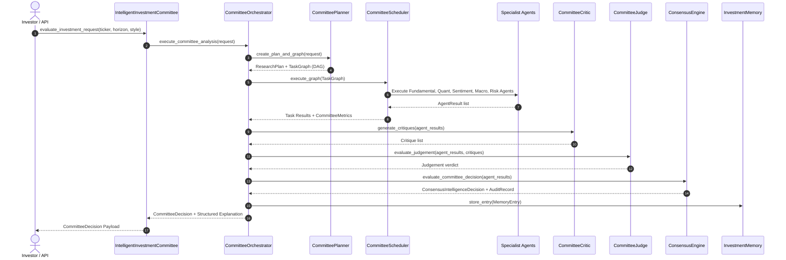

# Intelligent Investment Committee Engine Architecture

## 1. Executive Overview

The **Intelligent Investment Committee** (`packages/ai/committee/`) is the central reasoning brain of **MONEYYYYYY**. It acts as an institutional multi-agent investment committee that interprets investor intent, dynamically plans and schedules parallel task execution graphs, challenges recommendations via adversarial critique, synthesizes evidence quality via judicial evaluation, computes weighted consensus, and maintains persistent reasoning memory with prediction calibration.

---

## 2. Integrated System Architecture

```
+-----------------------------------------------------------------------------------+
|                        IntelligentInvestmentCommittee                             |
+-----------------------------------------------------------------------------------+
                                        |
                                        v
+-----------------------------------------------------------------------------------+
|                            CommitteeOrchestrator                                  |
+-----------------------------------------------------------------------------------+
       |                                |                                 |
       v                                v                                 v
+-----------------------+    +-----------------------+    +-------------------------+
|   CommitteePlanner    |    |   TaskGraphEngine     |    |   CommitteeScheduler    |
| (Intent & Agent Minim)|    |  (DAG Topological)    |    | (Parallel ThreadPool)   |
+-----------------------+    +-----------------------+    +-------------------------+
                                                                          |
                                                                          v
                                                          (5 Specialist Agents:     |
                                                           Fundamental, Quant/Tech, |
                                                           Sentiment/News, Macro,   |
                                                           Risk Agent)              |
                                                                          |
       +------------------------------------------------------------------+
       |                                |                                 |
       v                                v                                 v
+-----------------------+    +-----------------------+    +-------------------------+
|    CommitteeCritic    |    |    CommitteeJudge     |    |    ConsensusEngine      |
| (Adversarial Critique)|    | (Evidence Quality)    |    | (Weighted Score & Audit)|
+-----------------------+    +-----------------------+    +-------------------------+
                                                                          |
                                                                          v
                                                          +-------------------------+
                                                          |    InvestmentMemory     |
                                                          |  (Reasoning & Accuracy) |
                                                          +-------------------------+
```

### Core Components & Responsibilities
1. **Planner (`planner.py`)**: Parses investor request intent, horizon (`INTRADAY`, `DAILY`, `SWING`, `LONG_TERM`), and style (`VALUE`, `GROWTH`, `QUANTITATIVE`, `TECHNICAL`, `BALANCED`), determining the minimal required specialist agents and evidence types to eliminate redundant execution.
2. **Task Graph (`task_graph.py`)**: Constructs Directed Acyclic Graphs (DAG) representing task dependencies, execution order, priorities, and retry policies.
3. **Scheduler (`scheduler.py`)**: Executes DAG nodes in parallel using a worker thread pool (`ThreadPoolExecutor`), enforcing dependency resolution, timeouts, and partial failure policies.
4. **Critic (`critic.py`)**: Adversarial evaluator that challenges agent recommendations by detecting contradictions, weak assumptions, missing evidence, and overconfidence flags.
5. **Judge (`judge.py`)**: Judicial evaluator synthesizing overall evidence strength, agent quality, source coverage ratio, and penalized confidence.
6. **Consensus Engine Integration (`orchestration.py`)**: Reuses the existing domain `ConsensusEngine` to compute weighted vote scores and cryptographically signed SHA-256 audit signatures (`hash_signature`).
7. **Investment Memory (`memory.py`)**: Persistent reasoning memory storing decision entries, evidence summaries, confidence scores, actual outcomes, and prediction accuracy scores for future calibration (`calibration.py`).
8. **Explainer (`explanation.py`)**: Generates structured, non-freeform reasoning payloads explaining planning, execution, critiques, judgements, and consensus summaries.

---

## 3. Workflow & Sequence Diagrams

### Sequence Flow Diagram



---

## 4. Shared Models & Data Structures

- `ResearchRequest`: Target ticker, session ID, investment horizon, style, and parameters.
- `ResearchPlan`: Planned agent types, required evidence types, and estimated duration.
- `ResearchTask` & `TaskGraph`: DAG nodes with dependencies, status, priority, and retries.
- `Critique`: Targeted agent critique with contradiction, weak assumption, and overconfidence flags.
- `Judgement`: Verdict containing overall confidence, evidence strength, quality score, and source coverage.
- `CommitteeDecision`: Winning recommendation, consensus score, composite confidence, agreement ratio, judgement, critiques, and signed audit hash.
- `MemoryEntry`: Reasoning entry storing decision timestamp, evidence summary, actual outcome, and accuracy score.

---

## 5. Future Runtime & Portfolio Integration

### Runtime Engine Integration
The `TaskGraph` and `CommitteeScheduler` are designed runtime-agnostic. Future event-driven runtimes (e.g. Celery / Ray / Temporal) can execute the DAG nodes without changing committee models or domain logic.

### Portfolio Manager Integration
`CommitteeDecision` outputs feed directly into downstream Portfolio Management engines, providing weighted consensus signals, risk penalties, and confidence metrics required for automated asset allocation and rebalancing.
